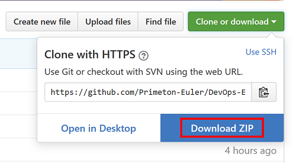

# DevOps-Examples
  
  
## Usage  
  
使用租户abc登陆SE门户，新建一个产品test，在这个产品下新建一个组件（springboot类型），组件Code为 c-springboot，查看产品的Git库地址，克隆仓库到本地，参考下面命令：  
  
`mkdir -p ~/DevOps/git`  
`cd ~/DevOps/git`  
`git clone http://euler-gitlab.theplatform.top/tenant-abc/tenant-abc-test.git `  
  
## Download DevOps Example Project

[https://github.com/Primeton-Euler/DevOps-Examples.git](https://github.com/Primeton-Euler/DevOps-Examples.git)  
  
`cd ~/DevOps/git`  
`git clone https://github.com/Primeton-Euler/DevOps-Examples.git`  
`rm -rf DevOps-Examples/.git`  
`cp DevOps-Examples/* tenant-abc-test/`  
  
`# commit source code`  
`cd ~/DevOps/git/tenant-abc-test`  
`git add .`  
`git commit -m "Update: commit source code"`  
`git push`  
  
也可以从github仓库`https://github.com/Primeton-Euler/DevOps-Examples.git`首页下载源码包：  
  
  
  
  
  
`# or use curl/wget linux command tool`  
`curl https://codeload.github.com/Primeton-Euler/DevOps-Examples/zip/master -O /tmp/DevOps-Examples.zip`  
`unzip /tmp/DevOps-Examples.zip -d ~/git/`  
`# ...`  
  
  
## Configuration injection items  
  
打包某个组件之前请先配置该组件，配置项如下所示：（部分配置项有默认值，具体参考项目源码）  
  
### (1) c-springboot  
  
`db.url (*)`  
`db.user (*)`  
`db.password (*)`  
`home.title`  
  
### (2) c-frontapp  
  
`title`  
`body`  
`key1`  
`key2`  
`key3`  
`key4`  
  
### (3) c-war  
  
`title`  
`body`  
`key1`  
`key2`  
`key3`  
`key4`  
  
  
## Multi-Component
  
在 test产品下再新建2个组件，c-war（war类型）、c-frontapp（frontapp类型），`https://github.com/Primeton-Euler/DevOps-Examples.git`示例代码库已经包含该这2个组件的示例代码；可以直接在页面上编译打包这两个组件。如果你新建的组件的Code不是上面写的这些，请作如下修改：  
  
`# Source Code Directory`  
`|- pom.xml -> module改为各个组件编码`  
`|- c-springboot -> ${A组件编码}`  
`|- c-war -> ${B组建编码}`  
`|- c-frontapp -> ${C组件编码}`  
`|- .git`  
`|- ...`  
  
你还可以根据自己的项目需要继续添加其它组件。  
  